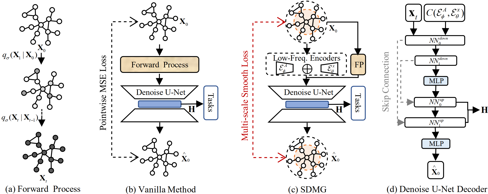
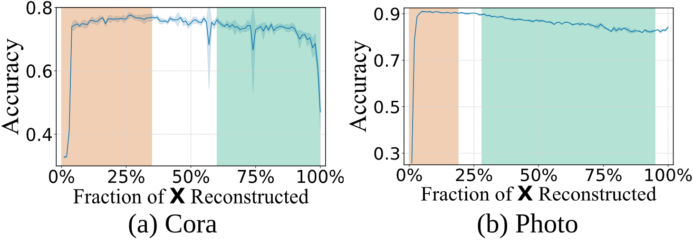

# Smooth Diffusion Models

This is the code for the ICML2025 paper "[SDMG: Smoothing Your Diffusion Models for Powerful Graph Representation Learning]".
The implementation of NSGNN is built based on [DDM](https://github.com/NeXAIS/DDM). We thank them for providing the codes and tools.

**SDMG** bridges the gap between generative and representation learning by aligning low-frequency reconstruction, enhancing performance across graph tasks. We evaluated **SDMG** on 11 public graph datasets.

## Datasets
**These datasets will be downloaded automatically when executing the code.**
### Graph classification datasets
- IMDB-B
- IMDB-M
- COLLAB
- PROTEINS
- MUTAG
### Node classification datasets
- Cora
- Citeseer
- PubMed
- Ogbn-arxiv
- Amazon-Computer
- Amazon-Photo

## Framework

## Usage
```shell
conda create -n SDMG python=3.10
conda activate SDMG
pip install -r requirements.txt
```

Change directory to the specific example folder ( `MUTAG` for a graph-level experiment )
```shell
cd GraphExp
python main_graph.py --yaml_dir ./yamls/MUTAG.yaml
```

## Investigation
### Classification accuracy across varying fractions of low-frequency components reconstruction on two datasets.


## Results
### Node classification performance (%)
<table>
  <thead>
    <tr>
      <th>Category</th>
      <th>Method</th>
      <th>Cora</th>
      <th>CiteSeer</th>
      <th>PubMed</th>
      <th>Ogbn-arxiv</th>
      <th>Computer</th>
      <th>Photo</th>
    </tr>
  </thead>
  <tbody>
    <tr>
      <td rowspan="2"><em>Supervised</em></td>
      <td>GCN</td>
      <td>81.5 ±0.5</td>
      <td>70.3 ±0.6</td>
      <td>79.0 ±0.4</td>
      <td>71.7 ±3.0</td>
      <td>86.5 ±0.5</td>
      <td>92.4 ±0.2</td>
    </tr>
    <tr>
      <td>GAT</td>
      <td>83.0 ±0.7</td>
      <td>72.5 ±0.5</td>
      <td>79.0 ±0.3</td>
      <td>72.1 ±0.1</td>
      <td>86.9 ±0.3</td>
      <td>92.6 ±0.4</td>
    </tr>
    <tr>
      <td rowspan="2"><em>Random Walk</em></td>
      <td>node2vec</td>
      <td>74.8</td>
      <td>52.3</td>
      <td>80.3</td>
      <td>-</td>
      <td>84.39</td>
      <td>89.67</td>
    </tr>
    <tr>
      <td>DeepWalk</td>
      <td>75.7</td>
      <td>50.5</td>
      <td>80.5</td>
      <td>-</td>
      <td>85.68</td>
      <td>89.44</td>
    </tr>
    <tr>
      <td rowspan="13"><em>Self-Supervised</em></td>
      <td>DGI</td>
      <td>82.3 ±0.6</td>
      <td>71.8 ±0.7</td>
      <td>76.8 ±0.6</td>
      <td>70.3 ±0.2</td>
      <td>84.0 ±0.5</td>
      <td>91.6 ±0.2</td>
    </tr>
    <tr>
      <td>MVGRL</td>
      <td>83.5 ±0.6</td>
      <td>73.3 ±0.5</td>
      <td>80.1 ±0.7</td>
      <td>70.3 ±0.5</td>
      <td>87.5 ±0.1</td>
      <td>91.7 ±0.1</td>
    </tr>
    <tr>
      <td>BGRL</td>
      <td>82.7 ±0.6</td>
      <td>71.1 ±0.8</td>
      <td>79.6 ±0.5</td>
      <td>71.6 ±0.1</td>
      <td>89.7 ±0.3</td>
      <td>92.9 ±0.3</td>
    </tr>
    <tr>
      <td>InfoGCL</td>
      <td>83.5 ±0.3</td>
      <td>73.5 ±0.4</td>
      <td>79.1 ±0.2</td>
      <td>71.2 ±0.2</td>
      <td>88.7 ±0.4</td>
      <td>93.1 ±0.1</td>
    </tr>
    <tr>
      <td>CCA-SSG</td>
      <td>84.0 ±0.4</td>
      <td>73.1 ±0.3</td>
      <td>81.0 ±0.4</td>
      <td>71.2 ±0.2</td>
      <td>88.7 ±0.3</td>
      <td>93.1 ±0.1</td>
    </tr>
    <tr>
      <td>GPT-GNN</td>
      <td>80.1 ±1.0</td>
      <td>68.4 ±1.6</td>
      <td>76.3 ±0.8</td>
      <td>-</td>
      <td>-</td>
      <td>-</td>
    </tr>
    <tr>
      <td>GraphMAE</td>
      <td>84.2 ±0.4</td>
      <td>73.4 ±0.4</td>
      <td>81.1 ±0.4</td>
      <td>71.8 ±0.2</td>
      <td>88.6 ±0.2</td>
      <td>93.6 ±0.2</td>
    </tr>
    <tr>
      <td>GraphTCM</td>
      <td>81.5 ±0.5</td>
      <td>72.8 ±0.6</td>
      <td>77.2 ±0.5</td>
      <td>54.7 ±0.2</td>
      <td>84.9 ±0.3</td>
      <td>92.1 ±0.2</td>
    </tr>
    <tr>
      <td>VGAE</td>
      <td>76.3 ±0.2</td>
      <td>66.8 ±0.2</td>
      <td>75.8 ±0.4</td>
      <td>66.4 ±0.2</td>
      <td>85.8 ±0.3</td>
      <td>91.5 ±0.2</td>
    </tr>
    <tr>
      <td>SP-GCL</td>
      <td>83.2 ±0.1</td>
      <td>71.9 ±0.4</td>
      <td>79.2 ±0.7</td>
      <td>68.3 ±0.2</td>
      <td>89.7 ±0.2</td>
      <td>92.5 ±0.3</td>
    </tr>
    <tr>
      <td>GraphACL</td>
      <td>84.2 ±0.3</td>
      <td>73.6 ±0.2</td>
      <td><strong>82.0 ±0.2</strong></td>
      <td>71.7 ±0.3</td>
      <td>89.8 ±0.3</td>
      <td>93.3 ±0.2</td>
    </tr>
    <tr>
      <td>DSSL</td>
      <td>83.5 ±0.4</td>
      <td>73.2 ±0.5</td>
      <td>81.3 ±0.3</td>
      <td>69.9 ±0.4</td>
      <td>89.2 ±0.2</td>
      <td>93.1 ±0.3</td>
    </tr>
    <tr>
      <td>DDM</td>
      <td>83.1 ±0.3</td>
      <td>72.1 ±0.4</td>
      <td>79.6 ±0.9</td>
      <td>71.3 ±0.3</td>
      <td>89.8 ±0.2</td>
      <td>93.8 ±0.2</td>
    </tr>
    <tr>
      <td><em>Our</em></td>
      <td>SDMG</td>
      <td><strong>84.3 ±0.5</strong></td>
      <td><strong>73.9 ±0.4</strong></td>
      <td>80.0 ±0.5</td>
      <td><strong>72.1 ±0.3</strong></td>
      <td><strong>91.6 ±0.2</strong></td>
      <td><strong>94.7 ±0.2</strong></td>
    </tr>
  </tbody>
</table>

### Graph classification performance (%)
<table>
  <thead>
    <tr>
      <th>Category</th>
      <th>Method</th>
      <th>IMDB-B</th>
      <th>IMDB-M</th>
      <th>PROTEINS</th>
      <th>COLLAB</th>
      <th>MUTAG</th>
    </tr>
  </thead>
  <tbody>
    <tr>
      <td rowspan="2"><em>Supervised</em></td>
      <td>GIN</td>
      <td>75.1 ±5.1</td>
      <td>52.3 ±2.8</td>
      <td><strong>76.2 ±2.8</strong></td>
      <td>80.2 ±1.9</td>
      <td>89.4 ±5.6</td>
    </tr>
    <tr>
      <td>DiffPool</td>
      <td>72.6 ±3.9</td>
      <td>-</td>
      <td>75.1 ±3.5</td>
      <td>78.9 ±2.3</td>
      <td>85.0 ±10.3</td>
    </tr>
    <tr>
      <td rowspan="3"><em>Random Walk</em></td>
      <td>node2vec</td>
      <td>50.20 ±0.90</td>
      <td>36.0 ±0.70</td>
      <td>57.49 ±3.57</td>
      <td>-</td>
      <td>72.63 ±10.20</td>
    </tr>
    <tr>
      <td>Sub2Vec</td>
      <td>55.26 ±1.54</td>
      <td>36.70 ±0.80</td>
      <td>53.03 ±5.55</td>
      <td>-</td>
      <td>61.05 ±15.80</td>
    </tr>
    <tr>
      <td>graph2vec</td>
      <td>71.10 ±0.54</td>
      <td>50.44 ±0.87</td>
      <td>73.30 ±0.05</td>
      <td>-</td>
      <td>83.15 ±9.25</td>
    </tr>
    <tr>
      <td rowspan="9"><em>Self-supervised</em></td>
      <td>InfoGraph</td>
      <td>73.03 ±0.87</td>
      <td>49.69 ±0.53</td>
      <td>74.44 ±0.31</td>
      <td>70.65 ±1.13</td>
      <td>89.01 ±1.13</td>
    </tr>
    <tr>
      <td>GraphCL</td>
      <td>71.14 ±0.44</td>
      <td>48.58 ±0.67</td>
      <td>74.39 ±0.45</td>
      <td>71.36 ±1.15</td>
      <td>86.80 ±1.34</td>
    </tr>
    <tr>
      <td>JOAO</td>
      <td>70.21 ±3.08</td>
      <td>49.20 ±0.77</td>
      <td>74.55 ±0.41</td>
      <td>69.50 ±0.36</td>
      <td>87.35 ±1.02</td>
    </tr>
    <tr>
      <td>GCC</td>
      <td>72.0</td>
      <td>49.4</td>
      <td>-</td>
      <td>78.9</td>
      <td>-</td>
    </tr>
    <tr>
      <td>MVGRL</td>
      <td>74.20 ±0.70</td>
      <td>51.20 ±0.50</td>
      <td>-</td>
      <td>-</td>
      <td>89.70 ±1.10</td>
    </tr>
    <tr>
      <td>GraphMAE</td>
      <td>75.52 ±0.66</td>
      <td>51.63 ±0.52</td>
      <td>75.30 ±0.39</td>
      <td>80.32 ±0.46</td>
      <td>88.19 ±1.26</td>
    </tr>
    <tr>
      <td>InfoGCL</td>
      <td>75.10 ±0.90</td>
      <td>51.40 ±0.80</td>
      <td>-</td>
      <td>80.00 ±1.30</td>
      <td>91.20 ±1.30</td>
    </tr>
    <tr>
      <td>SimGRACE</td>
      <td>71.30 ±0.77</td>
      <td>-</td>
      <td>75.35 ±0.09</td>
      <td>71.72 ±0.82</td>
      <td>89.01 ±1.31</td>
    </tr>
    <tr>
      <td>DDM</td>
      <td>74.05 ±0.17</td>
      <td>52.02 ±0.29</td>
      <td>71.61 ±0.56</td>
      <td>80.70 ±0.18</td>
      <td>90.15 ±0.46</td>
    </tr>
    <tr>
      <td><em>Our</em></td>
      <td>SDMG</td>
      <td><strong>76.03 ±0.53</strong></td>
      <td><strong>52.5 ±0.42</strong></td>
      <td>73.17 ±0.16</td>
      <td><strong>82.23 ±0.35</strong></td>
      <td><strong>91.58 ±0.28</strong></td>
    </tr>
  </tbody>
</table>
